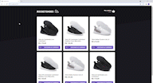

<p align="center">
  
  
  <a href="https://github.com/gabriel-savi/rocketshoes/commits/master">
    
  </a>
  
  

  <a href="https://github.com/gabriel-savi">
    
  </a>
</p>

<h1 align="center">
  <br> 
</h1>

 ## 🏁 Tópicos

<p>
  👉<a href="#-sobre-o-projeto" style="text-decoration: none; "> Sobre</a> <br/>
  👉<a href="#-como-executar-o-projeto" style="text-decoration: none"> Como executar</a> <br/>
  👉<a href="#-tecnologias" style="text-decoration: none"> Tecnologias</a> <br/>
  👉<a href="#-autor" style="text-decoration: none"> Autor</a> <br/>
</p>

## 💻 Sobre o projeto

O objetivo da aplicação desenvolvida é a criação de um e-commerce de sapatos, com a finalidade de praticar os conceitos aprendidos de React, HTML, CSS, Styled Components, Redux Saga, além da criação de uma API fake utilizando JSON-Server.

## 🚀 Como executar o projeto

Este projeto contém apenas uma parte:

1. Frontend

### Pré-requisitos

Antes de começar, você vai precisar ter instalado em sua máquina a seguinte ferramenta:
[Node e NPM](https://nodejs.org/en/download/) <br />
Além disto é bom ter um editor para trabalhar com o código como [VSCode](https://code.visualstudio.com/)

#### 🧭 Rodando a aplicação web (Frontend)

```bash

# Clone este repositório
$ git clone https://github.com/gabriel-savi/rocketshoes.git

# Acesse a pasta do projeto no seu terminal/cmd
$ cd rocketshoes

# Instalar dependências #
$ npm install

# Instalar e iniciar JSON Server #
$ npm install -g json-server
$ json-server server.json

# Abrir novo terminal e iniciar o projeto #
$ npm start
```
## 🛠 Tecnologias

As seguintes ferramentas foram usadas na construção do projeto:

React, HTML, CSS, Styled Components, Redux Saga e JSON-Server.

#### **Utilitários**

- Editor: **[Visual Studio Code](https://code.visualstudio.com/)**

<a name="-autor"></a>

## 🦸‍♂️ **Autor**

<p>
<kbd>
 
 </kbd>
 <br />
 <sub><strong>🌟 Gabriel Savi 🌟</strong></sub>
</p>

[](https://www.linkedin.com/in/gabriel-antonio-savi-b4ab1816a/)
[](mailto:savi.gabriel@outlook.com)

---
Feito com :satisfied: por Gabriel Savi 👋🏽 [Entre em contato!](https://www.linkedin.com/in/gabriel-antonio-savi-b4ab1816a/)

---
